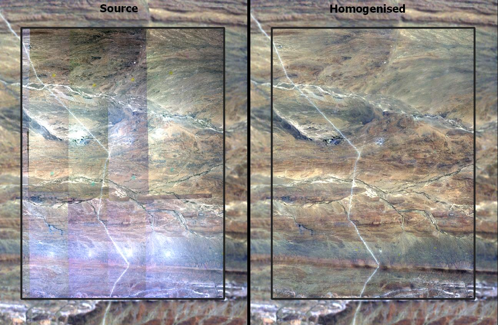

[comment]: <> ([![Publish]&#40;https://github.com/dugalh/geedim/actions/workflows/publish.yml/badge.svg&#41;]&#40;https://github.com/dugalh/geedim/actions/workflows/publish.yml&#41;)
[](https://github.com/dugalh/homonim/actions/workflows/test.yml)

[comment]: <> ([![codecov]&#40;https://codecov.io/gh/dugalh/geedim/branch/main/graph/badge.svg?token=69GZNQ3TI3&#41;]&#40;https://codecov.io/gh/dugalh/geedim&#41;)
[](https://www.gnu.org/licenses/agpl-3.0)

# homonim

Radiometric homogenisation of aerial and satellite imagery by fusion with satellite surface reflectance data.  

## Description

`homonim` corrects multi-spectral aerial and satellite imagery to approximate surface reflectance, by fusion with concurrent and collocated satellite surface reflectance data.  It is a form of *spectral harmonisation*, that  adjusts for spatially varying atmospheric and anisotropic (BRDF) effects, without the need for manual reflectance measurements, or target placements.  

It is useful as a pre-processing step for quantitative mapping applications, such as biomass estimation or precision agriculture, and can be applied to drone, aerial or satellite imagery.  

`homonim` is based on the method described in [*Radiometric homogenisation of aerial images by calibrating with satellite data*](https://www.researchgate.net/publication/328317307_Radiometric_homogenisation_of_aerial_images_by_calibrating_with_satellite_data).

## Installation
TBD
<!--`homonim` is available as a python 3 package, via `pip` and `conda`.  Under Windows, we recommend using `conda` to simplify the installation of binary dependencies.  The [Miniconda](https://docs.conda.io/en/latest/miniconda.html) installation provides a minimal `conda`.
### conda
```shell
$ conda install -c conda-forge homonim
```
### pip
```shell
$ pip install homonim
```-->

## Quick Start
Homogenise an image with a reference, using the `gain-blk-offset` method, a sliding kernel of 5x5 pixels:
```shell
$ homonim fuse --method gain-blk-offset --kernel-shape 5 5 source.tif reference.tif 
```
Statistically compare an image, pre- and post-homogenisation, with a reference image:
```shell
$ homonim compare source.tif homogenised.tif reference.tif
```

## Example
Mosaics of 0.5 m resolution aerial imagery before and after homogenisation.  A Landsat-7 surface reflectance image was used as reference, and is shown in the background.  Homogenisation was performed using the `im-blk-offset` method and a 5 x 5 pixel kernel.  



## Usage
See the documentation [here](docs/usage.rst).

## Terminology
While `homonim` implements a form of *spectral harmonisation*, we have used the term *homogenisation* to describe the method, in keeping with the [original formulation](https://www.researchgate.net/publication/328317307_Radiometric_homogenisation_of_aerial_images_by_calibrating_with_satellite_data).  *Homogenisation* is implemented using a form of image *fusion*.

## Credits

`homonim` depends on a number of [libraries](meta.yaml), making extensive use of the following excellent projects:

* [rasterio](https://github.com/rasterio/rasterio)
* [opencv](https://github.com/opencv/opencv) 
* [numpy](https://github.com/numpy/numpy)

## License
`homonim` is licensed under the terms of the [AGPLv3](https://www.gnu.org/licenses/agpl-3.0.en.html).  This project is developed in collaboration with [InnovUS](https://www.innovus.co.za/) at Stellenbosch University, alternative licenses can be arranged by [contacting](mailto:sjdewet@sun.ac.za) them.

## Citation
Please cite use of the code as: 
- Harris, D., Van Niekerk, A., 2019. Radiometric homogenisation of aerial images by calibrating with satellite data. *Int. J. Remote Sens.* **40**, 2623–2647. [https://doi.org/10.1080/01431161.2018.1528404](https://doi.org/10.1080/01431161.2018.1528404). 

## Author
**Dugal Harris** - [dugalh@gmail.com](mailto:dugalh@gmail.com)
