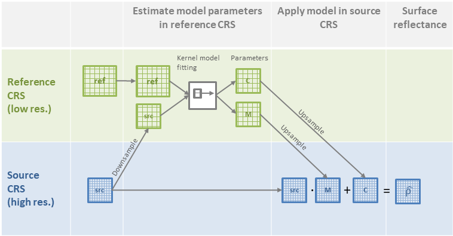

Advanced usage
==============

Block processing
----------------

``homonim`` processes source - reference image pairs in blocks.  This limits memory usage so that large images can be processed.  Processing speed is increased by processing blocks concurrently.  The block size (MB) and number of concurrent blocks can be set by the user with the ``--max-block-mem`` and ``--threads`` :ref:`command line parameters <cli:usage>`; and corresponding parameters in the :class:`~homonim.RasterFuse` and :class:`~homonim.RasterCompare` APIs.

Processing CRS and re-projections
---------------------------------

Processing (i.e. model fitting or image comparison) takes place in one of the source or reference image CRS's (coordinate reference system) and pixel grid.  This CRS and pixel grid is termed the *processing CRS*.  By default ``homonim`` selects the lowest resolution of the source and reference CRS's as the *processing CRS*.  This follows the `original formulation <https://www.researchgate.net/publication/328317307_Radiometric_homogenisation_of_aerial_images_by_calibrating_with_satellite_data>`_ of the method.  In the majority of cases, the reference is at a lower resolution than the source, meaning the *processing CRS* will be the reference CRS.

Before processing, ``homonim`` re-projects one of the source or reference so that both are in the same *processing CRS*.   In the typical case for surface reflectance correction, the source image is re-projected to the *reference CRS*.  Then, once calculated, the correction parameters are re-projected back to the source CRS, and applied to the source image to produce the corrected image.  The diagram below illustrates this process.

Similarly, when comparing images, ``homonim`` will re-project the source to the reference CRS in the typical case.  The comparison is then performed in this (the *processing CRS*), with no further re-projections.

``homonim`` will also work in the unusual case where the reference is at a higher resolution than the source, but here the default *processing CRS* is the source CRS.

``homonim`` uses *average* resampling when downsampling (re-projecting from high to low resolution), and *cubic spline* resampling when upsampling (re-projecting from low to high resolution), by default.  The reasons for these choices are explained in the `paper <https://raw.githubusercontent.com/leftfield-geospatial/homonim/main/docs/radiometric_homogenisation_preprint.pdf>`_.

While the default settings are recommended, the ``homonim`` CLI and API allow the user to specify the *processing CRS*, and resampling methods for *downsampling* and *upsampling*.  On the :ref:`command line <cli:usage>`, the relevant parameters are ``--proc-crs``, ``--downsampling`` and ``--upsampling``.  Corresponding arguments can be found in the :class:`~homonim.RasterFuse` and :class:`~homonim.RasterCompare` API's.

..
    TO DO: a why use homonim section with its advantages over other methods? speed (DFT & block proc), spatially varying correction &
    TO DO: an advanced section that discusses things like processing crs, block processing & mask_partial, param images
