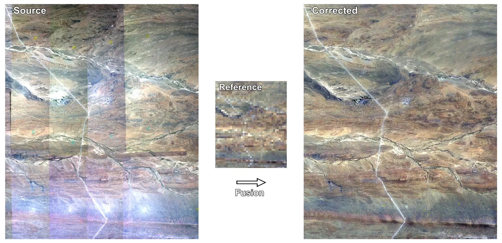

Background
==========

Reference image
---------------

``homonim`` fuses a *source* image with a *reference* surface reflectance image to produce the *corrected* image.  The *reference* must be supplied by the user, and is usually a satellite image at a coarser resolution that the *source*.  For best results, the *reference* should satisfy these criteria:

- **Co-location**: bounds of the *reference* image should cover those of the *source*, and *source* and *reference* should be ortho-rectified / co-registered.
- **Concurrency**: *source* and *reference* capture dates should be close in time, with minimal land cover change between them.
- **Spectral similarity**: the *reference* should contain bands whose spectral responses overlap with those of the *source*.

Satellite programs, such as Landsat, Sentinel-2, and MODIS, provide suitable *reference* imagery freely to the public.  |geedim|_ is recommended as a companion tool to ``homonim`` for acquiring cloud/shadow-free reference imagery from these, and other programs.  |geedim|_ acquired imagery includes metadata that is used by ``homonim`` for automatic spectral band matching.  Alternatively, satellite imagery is available from a number of sources including the `Google <https://developers.google.com/earth-engine/datasets>`_, `Amazon <https://aws.amazon.com/earth/>`_ and `Microsoft <https://planetarycomputer.microsoft.com/catalog>`_ repositories.

.. note::
    The `regression modelling <tutorials/regression_modelling.ipynb>`_ and `drone correction <tutorials/drone_correction.ipynb>`_ tutorials include sections showing the use of |geedim|_ for downloading reference imagery.

Source image
------------

Any orthorectified, multi-spectral *source* imagery can be used with ``homonim``, including drone, aerial and satellite imagery. *Source* images should  preferably be provided to ``homonim`` without gamma correction or colour balancing type adjustments.  If this is not possible, ``homonim`` should still improve surface reflectance accuracy.

Fusion
------

``homonim`` uses spatially varying localised *models* to describe the surface reflectance relationship between *source* and *reference*.  These *models* are fitted at each pixel location, inside a small *kernel* (window), using a fast `DFT <https://en.wikipedia.org/wiki/Discrete_Fourier_transform>`_ approach.  After fitting, ``homonim`` produces the *corrected* image by applying the models to the *source* (i.e. "fusing" the *source* with the *reference*).  From the user perspective, the *model* and *kernel shape* are the main parameters for configuring *fusion*.

Model
~~~~~

The following linear model variants are available for correcting to surface reflectance.

- *gain* : Gain-only model, suitable for haze-free and zero offset images (i.e. images where a surface reflectance of zero corresponds to a pixel value of ± zero).
- *gain-blk-offset*: Gain-only model applied to offset normalised image blocks.  Suitable for most *source*-*reference* combinations.
- *gain-offset*: Gain and offset model.  The most accurate model, but sensitive to differences between *source* and *reference*, such as shadowing and land cover changes.  Suitable for well-matched *source* / *reference* image pairs.

The derivation of the linear model approximation is given in the `paper <https://www.researchgate.net/publication/328317307_Radiometric_homogenisation_of_aerial_images_by_calibrating_with_satellite_data>`_.  Broadly speaking, gain compensates for atmospheric absorption and anisotropic (BRDF) effects, and offset (when present) compensates for atmospheric reflectance and haze.  Offset-compensated effects tend to vary gradually and over large spatial scales, while gain-compensated effects vary over smaller spatial scales, especially for low altitude imagery, and where land cover is heterogeneous.  The *gain-blk-offset* option models this behaviour with kernel-scale gain, and block-scale offset.  It can be seen as a compromise between the *gain* and *gain-offset* options.

The model type can be specified with the :option:`--model <homonim-fuse --model>` option via the command line; or with the corresponding arguments in the :meth:`homonim.RasterFuse.process` API.

Kernel shape
~~~~~~~~~~~~

The *kernel shape* is the (height, width) of the kernel in pixels of the :attr:`~homonim.RasterFuse.proc_crs` image.  In the default situation, where :attr:`~homonim.RasterFuse.proc_crs` = :attr:`~homonim.enums.ProcCrs.auto`, *kernel shape* will be in pixels of the lowest resolution of the *source* and *reference* images.

The scale of variation that correction can adjust for is roughly the size of the kernel.  Larger kernels are less susceptible to over-fitting on noisy data, but provide lower resolution correction.

The minimum *kernel shape* is *model* dependent.  For the two parameter :attr:`~homonim.enums.Model.gain_offset` model, the kernel should contain at least two pixels.  It can contain only one pixel for the single parameter :attr:`~homonim.enums.Model.gain` and :attr:`~homonim.enums.Model.gain_blk_offset` models.  The default value of ``(5, 5)`` will work reasonably well with the :attr:`~homonim.enums.Model.gain_blk_offset` model and most *source* - *reference* image combinations.  Kernels larger than ``(5, 5)`` are recommended for the :attr:`~homonim.enums.Model.gain_offset` model, to avoid over-fitting.

Kernel shape can be specified with the :option:`--kernel-shape <homonim-fuse --kernel-shape>` option via the command line; or with the corresponding argument in the :meth:`homonim.RasterFuse.process` API.

.. |geedim| replace:: ``geedim``
.. _geedim: https://github.com/leftfield-geospatial/geedim
