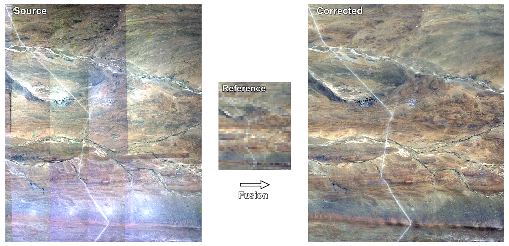

Background
==========

.. _reference_image:

Reference image
---------------

``homonim`` fuses a *source* image with a *reference* surface reflectance image to produce the *corrected* image.  The *reference* must be supplied by the user, and is usually a satellite image at a coarser resolution that the *source*.  For best results, the *reference* should satisfy these criteria:

- **Co-location**: bounds of the *reference* image should cover those of the *source*, and *source* and *reference* should be ortho-rectified / co-registered.
- **Concurrency**: *source* and *reference* capture dates should be close in time, with minimal land cover change between them.
- **Spectral similarity**: the *reference* should contain bands whose spectral responses overlap with those of the *source*.

Satellite programs, such as Landsat, Sentinel-2, and MODIS, provide suitable *reference* surface reflectance imagery freely to the public.  |geedim|_ is recommended as a companion tool to ``homonim`` for acquiring cloud/shadow-free reference imagery from these, and other programs.  |geedim|_ acquired imagery includes metadata that is used by ``homonim`` for automatic matching of spectral bands.  Alternatively, satellite imagery is available from a number of sources, including the `Google <https://developers.google.com/earth-engine/datasets>`_, `Amazon <https://aws.amazon.com/earth/>`_ and `Microsoft <https://planetarycomputer.microsoft.com/catalog>`_ repositories.

.. note::
    The `regression modelling <tutorials/regression_modelling.ipynb>`_ and `drone correction <tutorials/drone_correction.ipynb>`_ tutorials include sections showing the use of |geedim|_ for downloading reference imagery.

Source image
------------

Any orthorectified, multi-spectral *source* imagery can be used with ``homonim``, including drone, aerial and satellite imagery. *Source* images should  preferably be provided to ``homonim`` without gamma correction or colour balancing type adjustments.  If this is not possible, ``homonim`` will still improve surface reflectance accuracy.

Fusion
------

``homonim`` uses spatially varying localised *models* to describe the surface reflectance relationship between *source* and *reference*.  These *models* are fitted at each pixel location, inside a small *kernel* (window), using a fast DFT approach.  After fitting, ``homonim`` produces the *corrected* image by applying the models to the *source* (i.e. "fusing" the *source* with the *reference*).

From the user perspective, the *kernel shape* (pixel dimensions) and *model* are the main parameters for configuring *fusion*.  They can be specified with the :option:`--model <homonim-fuse --model>` and :option:`--kernel-shape <homonim-fuse --kernel-shape>` via the command line; or with the corresponding arguments in the :meth:`homonim.RasterFuse.process` API.  When not specified, ``homonim`` uses default values that will provide reasonable results for most use cases.

More details on the theoretical basis for the method can be found in the `paper <https://www.researchgate.net/publication/328317307_Radiometric_homogenisation_of_aerial_images_by_calibrating_with_satellite_data>`_.

.. |geedim| replace:: ``geedim``
.. _geedim: https://github.com/dugalh/geedim
