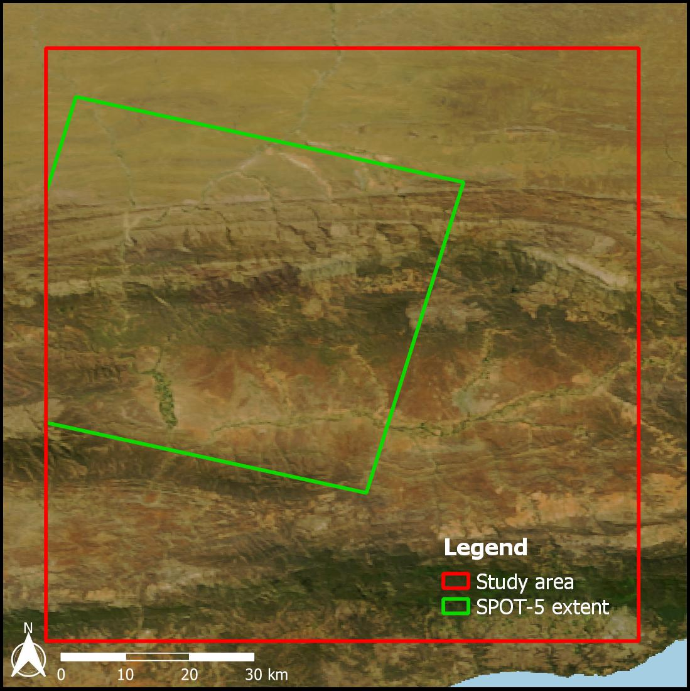
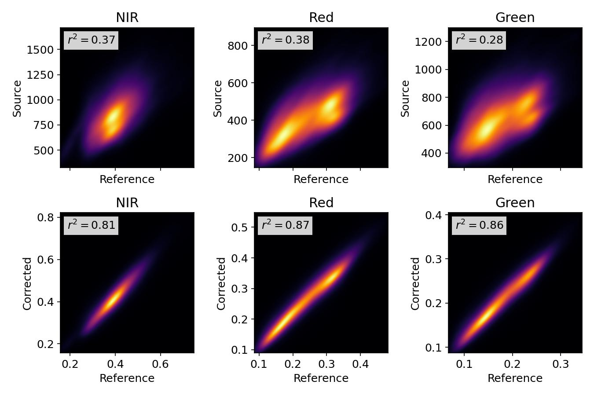

Aerial mosaic correction
========================

This case study is a summary of the `original presentation <https://www.researchgate.net/publication/328317307_Radiometric_homogenisation_of_aerial_images_by_calibrating_with_satellite_data>`_.  It demonstrates the correction and accuracy improvement of a mosaic of `NGI <https://ngi.dalrrd.gov.za/index.php/what-we-do/aerial-photography-and-imagery>`_ aerial images.

The mosaic consists of 2228 mages, captured over the Little Karoo (South Africa) from 22 Jan to 8 Feb 2010.  The images have a 50 cm spatial resolution and 4 spectral bands (red, green, blue and near-infrared).

.. figure:: aerial_mosaic-study_area.png
    :scale: 50 %
    :align: center

Correction
----------

A `MODIS NBAR <https://developers.google.com/earth-engine/datasets/catalog/MODIS_006_MCD43A4>`_ image was chosen for the reference.  The spatial resolution of the image is low (500 m), but it satisfies the recommendations discussed in the :ref:`background <reference_image>`, and so makes a reasonable choice.  Availability of images from other satellites was limited for the source capture dates.

The source aerial mosaic is overlaid on the MODIS reference in the figure below.  Seamlines between images, "hot spots", and other variations resulting from atmospheric and BRDF effects are clearly visible.

.. _source-mosaic:

.. figure:: aerial_mosaic-source_mosaic.jpg
    :width: 80%
    :align: center

    **Source mosaic**

Additive atmospheric effects were assumed negligible, and correction was performed with the :attr:`~homonim.enums.Model.gain` model.  A small kernel of 1 pixel was chosen to mitigate the effect of large (500 m) MODIS pixels.  The next figure shows the corrected mosaic overlaid on the MODIS reference.

.. figure:: aerial_mosaic-corrected_mosaic.jpg
    :width: 80%
    :align: center

    **Corrected mosaic**

There is a clear improvement from the source mosaic.  Seamlines and other variations are no longer visible, and there is a good match between the corrected images and the MODIS backdrop.

Evaluation
----------

To evaluate the relative improvement in surface reflectance accuracy, source and corrected mosaics were compared with a reference.  Rather than compare with the MODIS NBAR reference used for correction (which could positively bias the evaluation in the case of over-fitting), the mosaics were compared with an "independent" SPOT-5 image.  This 10 m resolution SPOT-5 image covered a portion of the study area.

    **SPOT-5 extent**

After correcting the SPOT-5 image to surface reflectance with ATCOR-3, it was compared to the source and corrected mosaics.  SPOT-5 does not have a blue band, so this was omitted from the comparison.

    **Source / corrected - reference correlation**

The correlation densities and *r*:sup:`2` correlation coefficients show a sizeable improvement after correction, demonstrating the value of surface reflectance correction.  Further details and discussion on this example can be found in the `paper <https://www.researchgate.net/publication/328317307_Radiometric_homogenisation_of_aerial_images_by_calibrating_with_satellite_data>`_
