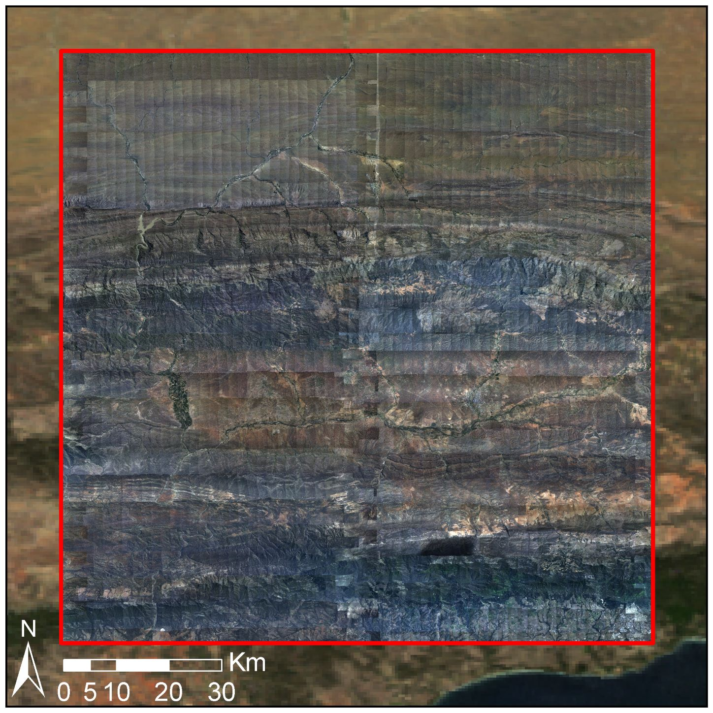
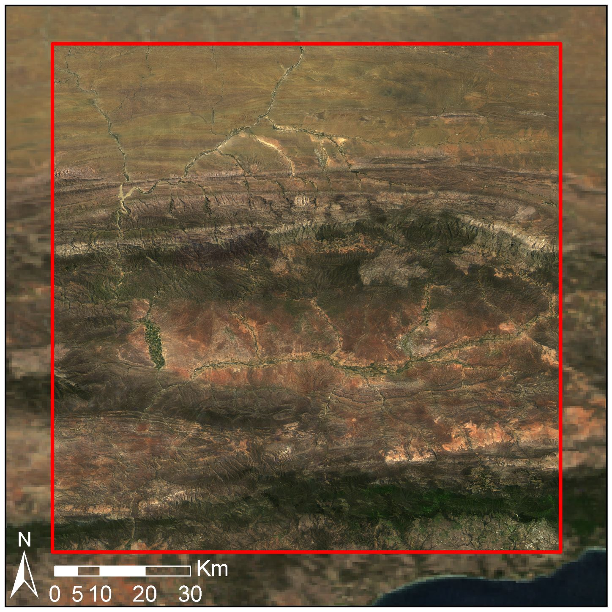
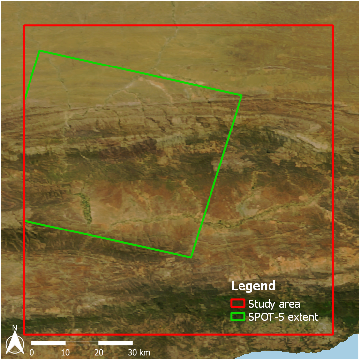
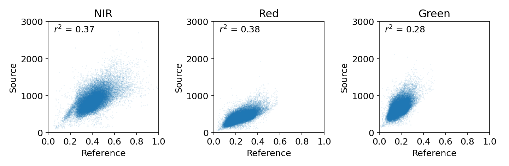
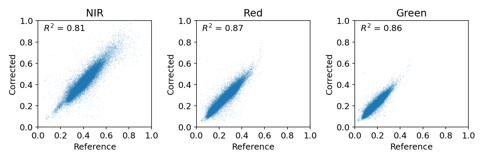

Aerial mosaic correction
========================

This case study is adapted from the original presentation in the `paper <https://raw.githubusercontent.com/dugalh/homonim/main/docs/radiometric_homogenisation_preprint.pdf>`_.  It demonstrates the correction of a large mosaic of `NGI <https://ngi.dalrrd.gov.za/index.php/what-we-do/aerial-photography-and-imagery>`_ aerial images with quite severe anisotropic (BRDF) effects.  Improvement in surface reflectance accuracy is evaluated by comparing the source and corrected mosaics with a SPOT-5 reference image.

The mosaic consists of ± 2000 mages, captured over the Little Karoo (South Africa) from 22 Jan to 8 Feb 2010.  The images have a 50 cm spatial resolution and 4 spectral bands (red, green, blue and near-infrared).  The location of the ± 1e6 ha study area is shown below.

.. image:: aerial_mosaic-study_area.png
    :scale: 50 %
    :align: center

|

Correction
----------

A MODIS NBAR (MCD43A4) image, concurrent with the source capture dates, was selected as the reference.  MCD43A4 images are 16 day best pixel composites, and are corrected for atmospheric and BRDF effects.  While the spatial resolution of the image is low (500 m), it satisfies the recommendations discussed in the `background section <../background.rst>`_, and so makes a reasonable choice.  The *source* aerial mosaic is overlaid on the MODIS reference in the figure below.  Seamlines between images, "hot spots", and other colour variations resulting from atmospheric and BRDF effects are clearly visible.

|

Correction was performed with the *gain-only* model and a kernel of 1 pixel.  The small kernel was chosen to mitigate the effect of large (500 m) MODIS pixels.  The next figure shows the corrected mosaic overlaid on the MODIS reference.  Seamlines and other variations are no longer visible, and there is a good match between the corrected images and the MODIS backdrop.

|

Evaluation
----------

The source and corrected mosaics were compared with a reference surface reflectance image to evaluate the relative improvement in surface reflectance accuracy.  Rather than compare with the MODIS NBAR reference, which was used for fitting the correction models, an "independent" SPOT-5 image was used.  This 10 m resolution image covered a portion of the study area.

|

After correcting the SPOT-5 image to surface reflectance with ATCOR-3, it was statistically compared to the source and corrected mosaics.  SPOT-5 does not have a blue band, so this was left out of the comparison.

The scatter plots and *R*:sup:`2` values show a sizeable improvement after correction.  Further details and discussions on this example can be found in the `paper <https://raw.githubusercontent.com/dugalh/homonim/main/docs/radiometric_homogenisation_preprint.pdf>`_

