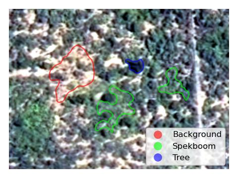

Classification
==============

This case study aims to show how ``homonim`` can assist in improving classifier performance.  It uses images and ground truth from a `study <https://www.researchgate.net/publication/329137175_Regional_mapping_of_spekboom_canopy_cover_using_very_high_resolution_aerial_imagery>`_ that mapped canopy cover of spekboom (a species of succulent shrub) in the Little Karoo, South Africa.

The data consists of 4 raw and corrected `NGI <https://ngi.dalrrd.gov.za/index.php/what-we-do/aerial-photography-and-imagery>`_ images with 50 cm spatial resolution and 4 spectral bands (red, green, blue and near-infrared) .  These images are a sub-set of the mosaics described in the `aerial mosaic correction <aerial_mosaic.rst>`_ case study.  Ground truth is made up of 161 polygons with labels for 3 vegetation classes:

===============  ==============================================
**Class**        **Description**
===============  ==============================================
Spekboom         A species of succulent shrub.
Tree             Woody trees.
Background       Other vegetation, bare ground etc.
===============  ==============================================

Some example polygons are shown below, overlaid on an aerial image.

    **Class polygons**

Correction
----------

The corrected images were produced with a *gain* :ref:`model <background:model>`, a 1 x 1 pixel :ref:`kernel <background:kernel shape>`, and a `MODIS NBAR <https://developers.google.com/earth-engine/datasets/catalog/MODIS_006_MCD43A4>`_  reference image.  Some detail on these choices is given in the `aerial mosaic correction <aerial_mosaic.rst>`_ study.  Using the blue and NIR pixel values as features, class densities (Gaussian kernel density estimates) are shown before and after correction below.

    **Class densities**

The classes appear more compact, and likely better separated after correction.

Evaluation
----------

A basic classifier was evaluated on the source and corrected imagery to quantify the effect of surface reflectance correction.  Evaluation used the red, green, blue and NIR pixel values as features in a naive Bayes classifier, and a 10-fold cross-validation for testing.  Accuracy increased from 58% to 67% demonstrating an improvement in the descriptive power of the image.

Normalised confusion matrix, accuracy, and `AUC <https://developers.google.com/machine-learning/crash-course/classification/roc-and-auc>`_ values for source and corrected images are tabulated below.

+----------------+-----------------------------------------------------+----------+------+
|                | Confusion matrix                                    | Accuracy | AUC  |
+================+=====================================================+==========+======+
| **Source**     |  +----------------+------------+----------+------+  | 58.41 %  | 0.73 |
|                |  |                | Background | Spekboom | Tree |  |          |      |
|                |  +================+============+==========+======+  |          |      |
|                |  | **Background** |       0.43 |     0.13 | 0.43 |  |          |      |
|                |  +----------------+------------+----------+------+  |          |      |
|                |  | **Spekboom**   |       0.09 |     0.62 | 0.29 |  |          |      |
|                |  +----------------+------------+----------+------+  |          |      |
|                |  | **Tree**       |       0.07 |     0.23 | 0.70 |  |          |      |
|                |  +----------------+------------+----------+------+  |          |      |
+----------------+-----------------------------------------------------+----------+------+
| **Corrected**  |  +----------------+------------+----------+------+  | 67.47 %  | 0.81 |
|                |  |                | Background | Spekboom | Tree |  |          |      |
|                |  +================+============+==========+======+  |          |      |
|                |  | **Background** |       0.56 |     0.17 | 0.28 |  |          |      |
|                |  +----------------+------------+----------+------+  |          |      |
|                |  | **Spekboom**   |       0.07 |     0.72 | 0.21 |  |          |      |
|                |  +----------------+------------+----------+------+  |          |      |
|                |  | **Tree**       |       0.04 |     0.21 | 0.74 |  |          |      |
|                |  +----------------+------------+----------+------+  |          |      |
+----------------+-----------------------------------------------------+----------+------+

