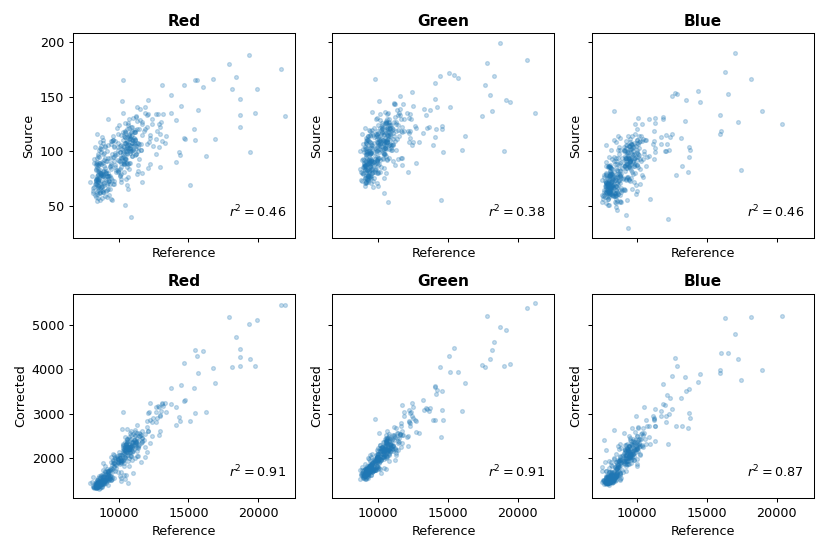

Drone mosaic correction
========================

``homonim`` can be used to correct any orthorectified multi-spectral imagery.  This case study demonstrates the correction of a drone ortho-mosaic.

Correction
----------

A 5 cm resolution, RGB ortho-mosaic was obtained from `Open Aerial Map <https://openaerialmap.org/>`_.  The image covers a complex, heterogeneous area.  Correction was performed with a Sentinel-2 reference, the *gain_blk_offset* :ref:`model <background:model>`, and a :ref:`kernel shape <background:kernel shape>` of 3 x 3 pixels.  Of the tested settings, these produced the best evaluation results.

.. figure:: drone_mosaic-src_ref_corr.jpg
    :width: 80%
    :align: center

    **Source, reference & corrected images**

Improvement in surface reflectance is less obvious in this figure than the :ref:`aerial mosaic case study <source-mosaic>`, as source mosaic seamlines have already been smoothed by the drone processing software.  Quantitative results in the next section give a clearer indication of the surface reflectance accuracy.

Evaluation
----------

The source and corrected drone images were compared with a second, Landsat-8 reference to evaluate the change in surface reflectance accuracy.  The scatter plots below show an improvement in correlation with the reference after correction.

    **Source & corrected - reference comparison**

.. note::
    The figures in this case study are generated by the `drone correction tutorial <../tutorials/drone_correction.ipynb>`_.

    The `ortho-image <https://oin-hotosm.s3.amazonaws.com/6202ec307b3a500007430480/0/6202ec307b3a500007430481.tif>`_ was obtained from `Open Aerial Map <https://openaerialmap.org/>`_  under the `CC BY 4.0 <https://creativecommons.org/licenses/by/4.0/>`_ license.
