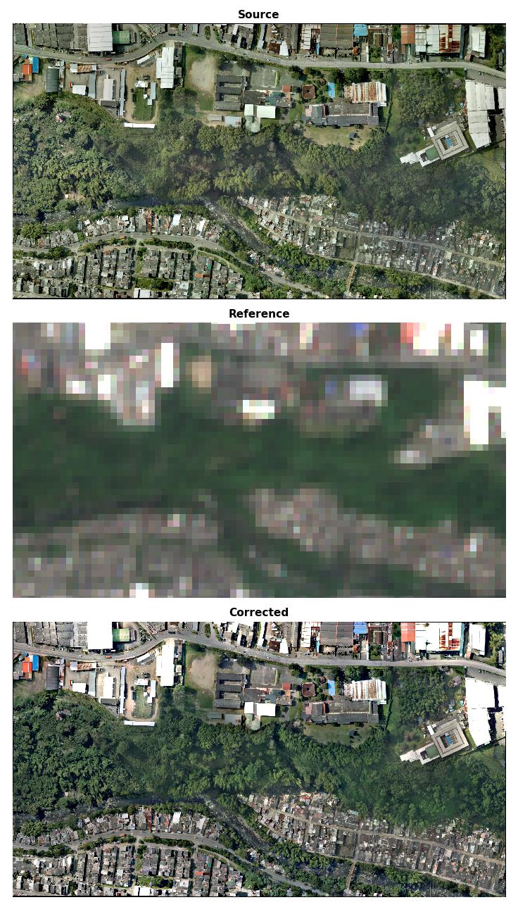

Drone mosaic correction
========================

``homonim`` can be used to correct any orthorectified multi-spectral imagery.  This case study demonstrates the correction of a drone ortho-mosaic.

Correction
----------

The 5 cm resolution, RGB drone ortho-image was corrected with the `gain-blk-offset` model, a kernel size of 3 x 3 pixels, and a Sentinel-2 reference.  The drone image covers a diverse, complex area, making it a challenging example.

    **Source, reference & corrected images**

The improvement in surface reflectance is less obvious in this figure, than e.g. in the :ref:`aerial mosaic case study <corrected-mosaic>`, as seamlines and other variation has already been smoothed out by the drone processing software.  Nevertheless, there is good colour correspondence between the corrected and reference images.

Evaluation
----------

The source and corrected drone images were compared with a second, Landsat-8 reference to better evaluate surface reflectance accuracy.  The scatter plots below show a sizeable improvement in correlation with the reference after correction.

.. figure:: drone_mosaic-eval.png
    :align: center

    **Source & corrected reference comparison**

.. note::

    The figures in this case study are generated by the `drone mosaic tutorial <../tutorials/drone_mosaic.ipynb>`_.

    The `drone mosaic <https://oin-hotosm.s3.amazonaws.com/6202ec307b3a500007430480/0/6202ec307b3a500007430481.tif>`_ was obtained from `Open Aerial Map <https://openaerialmap.org/>`_ under the `CC BY 4.0 <https://creativecommons.org/licenses/by/4.0/>`_ license.
