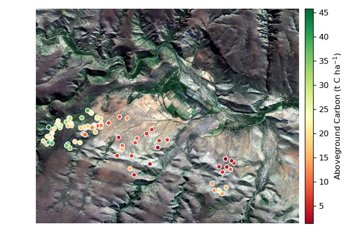
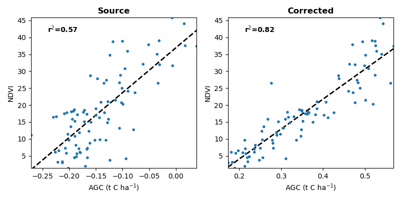

Regression modelling
====================

``homonim`` can help improve accuracy and consistency in quantitative remote sensing applications.  This case study demonstrates the use of ``homonim`` to improve the relevance of image features for modelling aboveground carbon (AGC).  The images and ground truth data are taken from an `AGC mapping study <https://github.com/dugalh/map_thicket_agc>`_.  This study investigated mapping AGC in the thicket biome (South Africa) from multi-spectral imagery.

A small mosaic of 4 `NGI <https://ngi.dalrrd.gov.za/index.php/what-we-do/aerial-photography-and-imagery>`_ aerial images covering the study site were corrected to surface reflectance with ``homonim``.  Correction was performed with the *gain-blk-offset* model, a kernel shape of 15x15 pixels, and a Sentinel-2 reference image.  AGC ground truth data for 85 plots is overlaid on the corrected mosaic in the figure below.

In this example, it turns out NDVI is reasonably good predictor of AGC.  The next figure shows the correlation of NDVI and AGC for each ground truth plot, before and after correction to surface reflectance.

Even though source image variations due to BRDF and atmospheric effects are small, correction to surface reflectance produces a useful improvement in the NDVI - AGC correlation.  This simple demonstration shows that ``homonim`` can help as a pre-processing step in regression modelling and related applications.

.. note::
    The figures in this case study are generated by the `regression modelling tutorial <../tutorials/regression_modelling.ipynb>`_.  More details on the data and original study can be found in the related `github repository <https://github.com/dugalh/map_thicket_agc>`_ and `paper <https://www.researchgate.net/publication/353313021_Very_high_resolution_aboveground_carbon_mapping_in_subtropical_thicket>`_.

..
    TODO: change pngs to jpgs where appropriate
          get the matplotlib font size right

