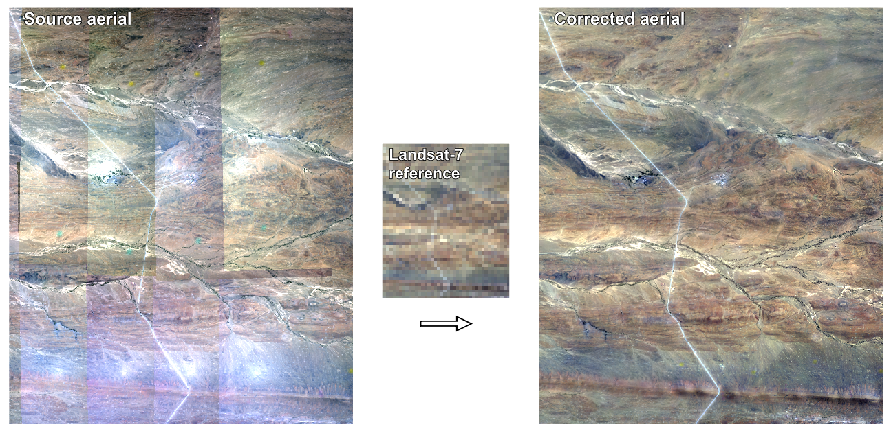

homonim
=======

.. include:: ../README.rst
    :start-after: short_descr_start
    :end-before: short_descr_end

.. include:: description.rst

.. include:: installation.rst

.. include:: usage.rst

Contents
--------

.. toctree::
   :maxdepth: 2

   description
   installation
   usage
   cli
   api

* :ref:`genindex`

